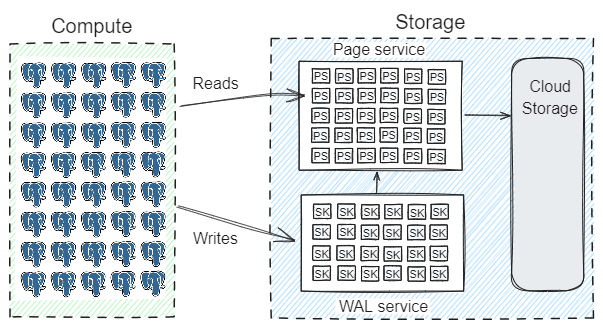
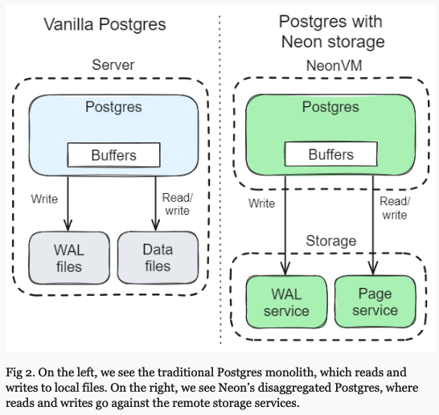
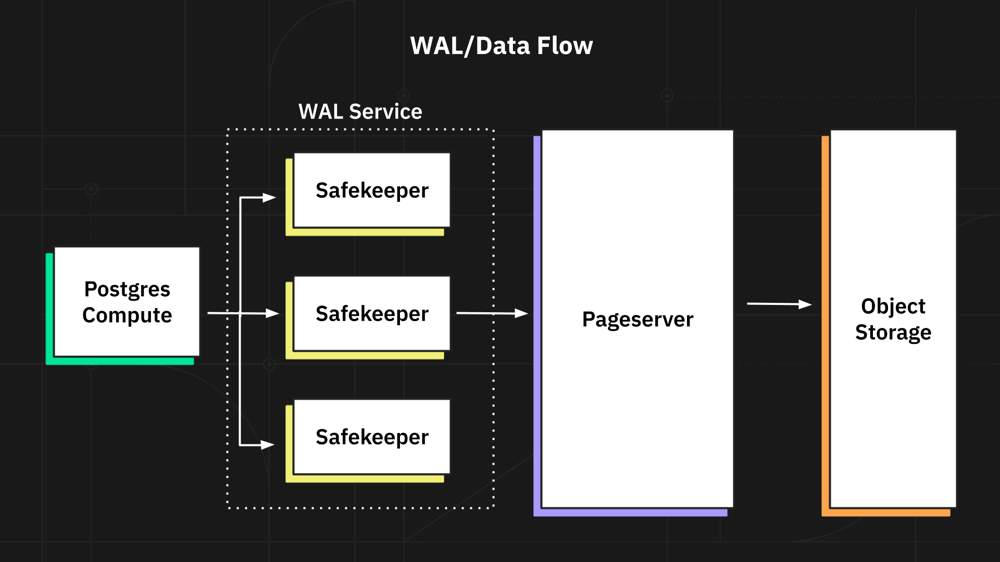

# Overview

Features
- serverless, disaggregated, multi-tenant Postgres
- point-in-time query model

Principles: separating storage and compute
- a stateless compute layer with Postgres instances.
- a disaggregated storage layer: fleet of storage nodes where each node stores data of multiple tenants.

Motivation
1. good price/ performance, pay only when you use.
2. modern replication techniques to provide high availability and high durability to Postgres.
3. simplify the life of developers by bringing the serverless consumption model to Postgres.
4. reuse Postgres by leveraging pluggable storage layer.

Design decisions
1. interface between compute and storage.
2. consensus algo for persisting WAL.
3. whether to have two services: one for WAL and one for serving pages or one that combines all of it. Aurora has one, SQL Server, which came later, has two.
4. lower latency?

How?
- patching Postgres to intercept writes to WAL and data files
- patching Postgres to ensure cache evictions incur no writes to local disk

Components
1. WAL Service = n * Safekeeper
   - receives WAL from Postgres and runs consensus algo
2. Pageserver
   - stores committed WAL
   - reconstructs a page at any given point of WAL on request from compute layer

Read request
1. compute node sends `GetPage@LSN`
2. page server reconstructs requested page at that version
   1. check recent in-memory layer, return if available
   2. locate layer file that has page version