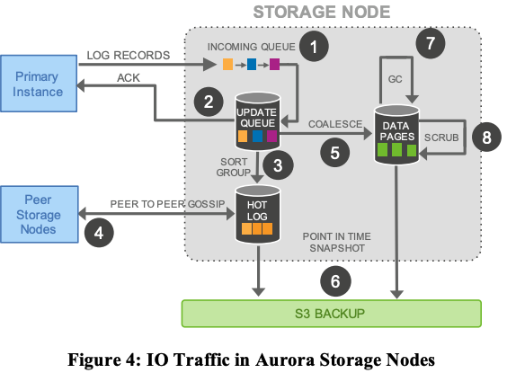

# Latency

## Aurora 2017 paper

### 1-Intro
- transactions 2PC are high latency because high scale systems are distributed across multiple data centers.

### 3-Log is the database/3.1 burden of amplified writes
- IOs result in points of sync that stall pipelines and increase latencies.
- While chain replication [8] and its alternatives can reduce network cost, they still suffer from synchronous stalls and additive latencies. 
- latency is additive because many writes are sequential.

### 3.3 storage service design points
- a core design principle for storage service is to `minimize latency of foreground write request`.
- moved majority of storage processing to background.
- fig4 design benefits
  - each of steps are async
  - only step (1) and (2) are in `foreground` path and potentially impact latency.

Refs
- [8] R. van Renesse and F. Schneider. Chain replication for
supporting high throughput and availability. In OSDI 2004.

### 6 Result

edu tech company migrated from MySQL to Aurora
- `SELECT latency` p99 reduced from 40-80ms to <5ms (near p50)
- per-record `INSERT latency` reduced from 40-80ms to <5ms (near p50)

